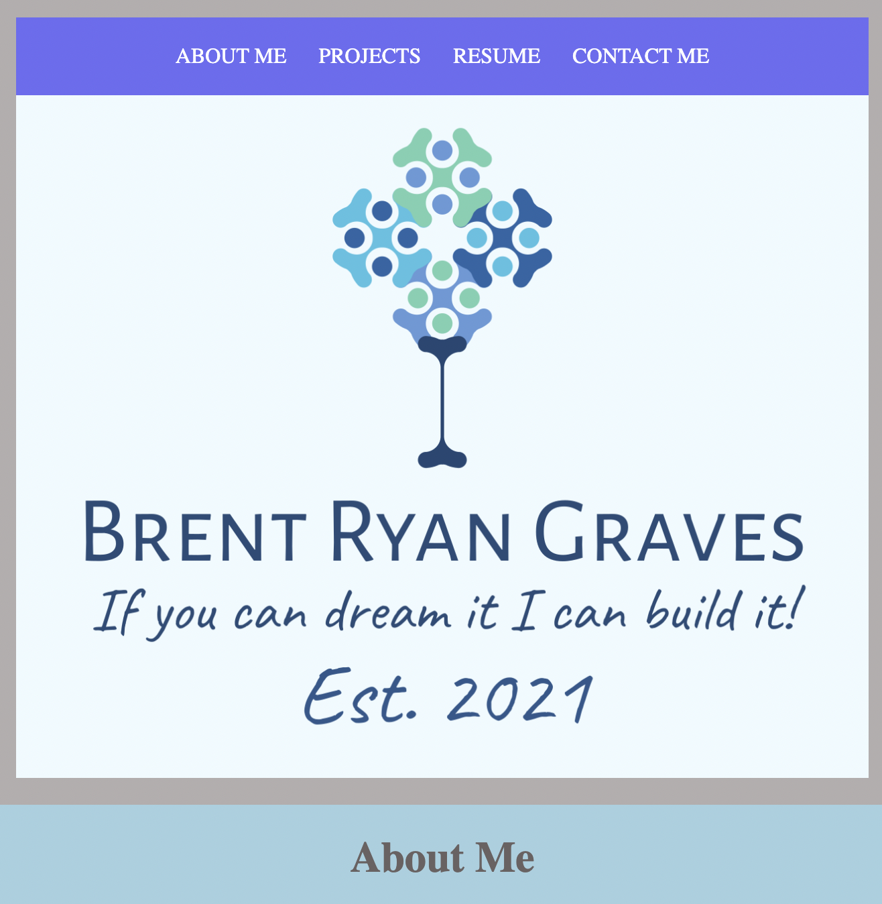
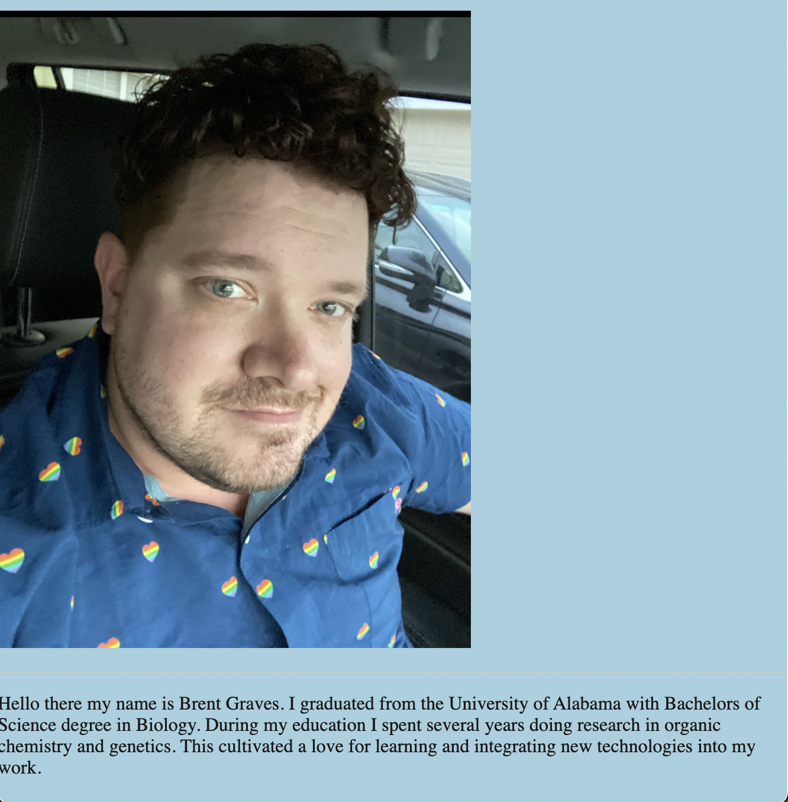
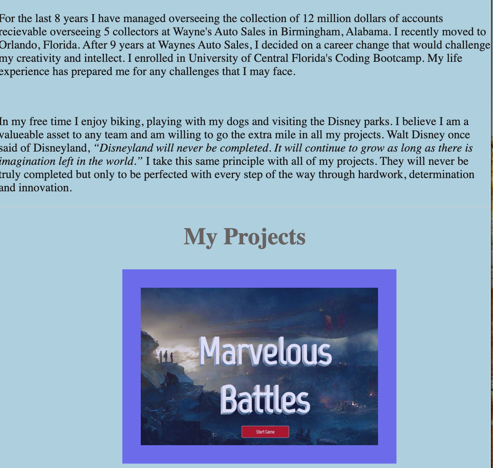
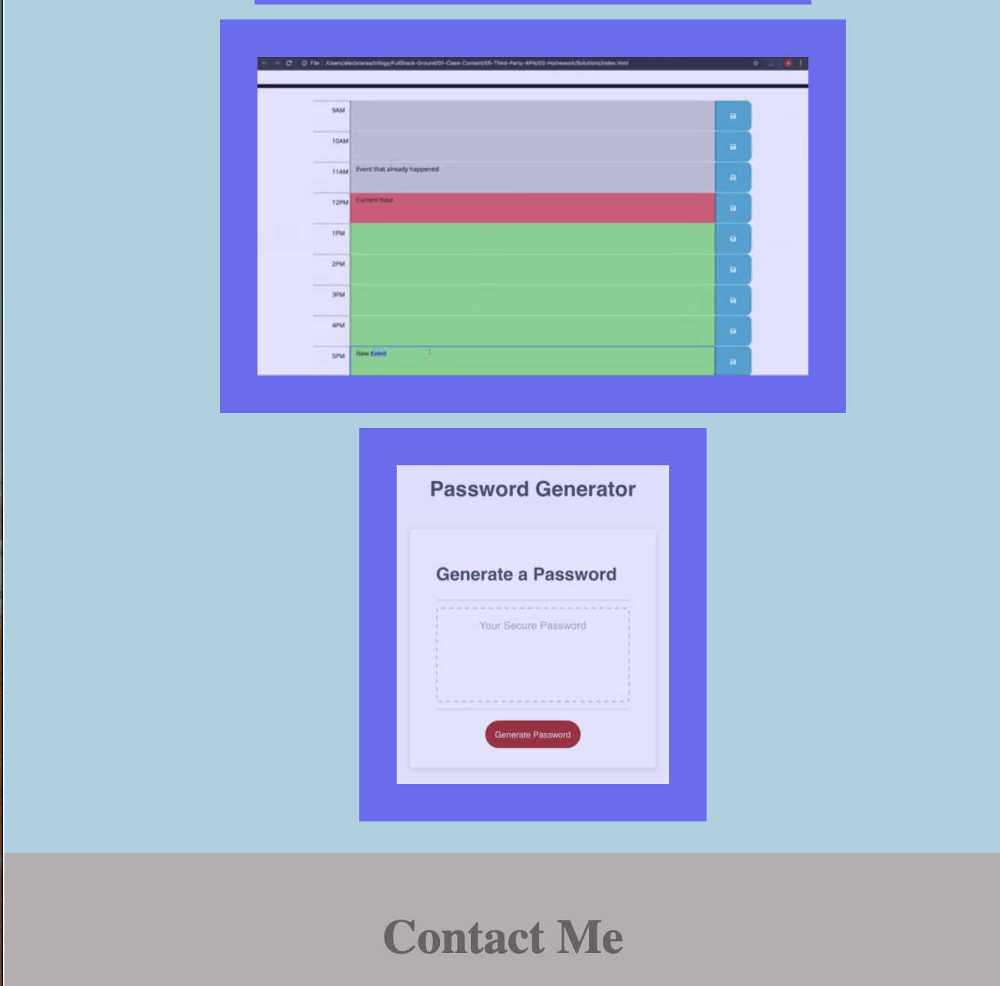
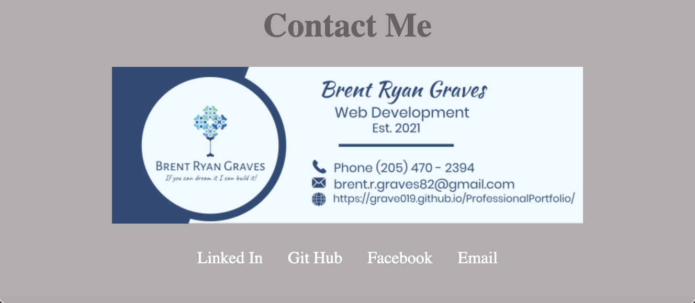

# ProfessionalPortfolio

## 1. Introduction

## 2. Web Development Tools

## 3. Images of the Live Web Page

## 4. Link to the Web Page

## 5. Acknowledgements

### 1. Introduction

I designed this portfolio to introduce myself to the greater web development community. I am learning daily to develop my skills and I welcome any critisism or encouragement you would like to give. I believe through hard work and determination I can achieve the greatest of heights and look forward to walk the path life has before me.

### 2. Web Development Tools
   
   To design this portfolio I used mainly CSS with flexboxes and html. As I become more accomplished this portfolio will evolve in the coming weeks and years to better reflect my skills and development. Thank you for taking the time view my page.

### 3. Images of the live Site

### 4. Follow the link below to visit the live Web Page

https://grave019.github.io/ProfessionalPortfolio/

### 5. Acknowledgements

The following material and links were used when designing and building this page. I would also like to thank the staff at UCF Bootcamp for continuing to cultivate my skills and grow my knowledge.

https://css-tricks.com/almanac/properties/a/animation/

https://www.brandcrowd.com/

http://html5doctor.com/html-5-reset-stylesheet/

https://eloquentjavascript.net/